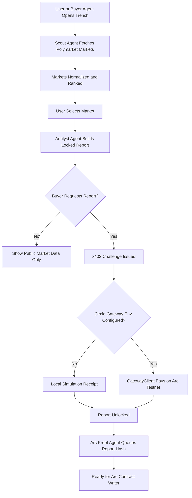

# Trench

Trench is an agentic prediction-market intelligence desk for Agora Agents. Buyer agents can discover live markets, request paid analyst packets, satisfy an x402 USDC challenge, and queue report hashes for Arc proof publication.

The current product focuses on a narrow but judge-visible loop: market discovery, autonomous scoring, paid report unlock, and proof-ready settlement metadata.

## Why It Exists

Prediction markets are useful only when someone can continuously watch prices, liquidity, deadlines, and news-driven drift. Trench turns that work into an agent workflow:

- **Scout Agent** ranks active markets by liquidity, volume, and deadline pressure.
- **Analyst Agent** estimates fair probability, edge, confidence, catalysts, and risks.
- **Buyer Agent** requests locked reports and handles the x402 payment path.
- **Arc Proof Agent** prepares the report hash and signal metadata for onchain publication.

Public browsing remains open without a wallet, which matches common dapp behavior. Wallet or agent credentials are only needed for paid report access and onchain proof actions.

## Technical Flow



## Architecture

```text
src/
  components/          React UI surfaces
  services/            Browser API clients
  types/               Frontend market and report contracts

server/
  agents/              Scout, Analyst, Buyer, Arc Proof logic
  lib/                 Probability, edge, confidence, hash helpers
  storage/             In-memory report store for local demo runs
  index.ts             Express API and x402-ready report unlock route
```

## API Surface

| Route | Purpose |
| --- | --- |
| `GET /api/markets` | Runs Scout Agent and returns ranked markets. |
| `POST /api/analyze` | Runs Analyst Agent for a selected market. |
| `POST /api/reports/request` | Creates or retrieves a locked report and x402 challenge. |
| `POST /api/payments/settle` | Settles locally or pays through Circle Gateway when env is configured. |
| `POST /api/reports/unlock` | x402-protected unlock route. |
| `POST /api/proofs` | Queues report hash metadata for Arc publication. |
| `GET /api/health` | Shows API and x402 configuration state. |

## Local Development

Run the API:

```bash
npm run api
```

Run the frontend:

```bash
npm run dev
```

The Vite dev server proxies `/api` to `http://127.0.0.1:8787`.

## Circle x402 Mode

Trench runs without secrets in local simulation mode. To enable the real Circle Gateway x402 path, set these environment variables before starting the API:

```bash
CIRCLE_SELLER_ADDRESS=0x...
CIRCLE_BUYER_PRIVATE_KEY=0x...
ARC_RPC_URL=https://...
```

`ARC_RPC_URL` is optional for the SDK, but useful when using a Canteen Arc RPC. Never commit `.env` files, private keys, or token-bearing RPC URLs.

## Current Status

- Live Polymarket market ingestion is implemented.
- Analyst report generation is implemented.
- x402 server integration is installed and wired behind environment configuration.
- Local payment simulation keeps demos working without secrets.
- Arc proof queue is implemented as metadata, not yet a real contract write.

## Verification

```bash
npm run lint
npm run build
npm run server:build
```
