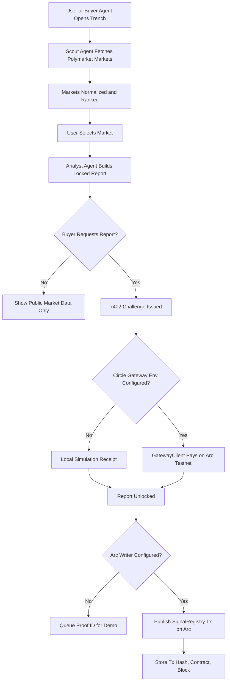

# Trench

Trench is an agentic prediction-market intelligence desk for Agora Agents. Buyer agents can discover live markets, request paid analyst packets, satisfy an x402 USDC challenge, and queue report hashes for Arc proof publication.

The current product focuses on a narrow but judge-visible loop: market discovery, autonomous scoring, paid report unlock, and proof-ready settlement metadata.

## Why It Exists

Prediction markets are useful only when someone can continuously watch prices, liquidity, deadlines, and news-driven drift. Trench turns that work into an agent workflow:

- **Scout Agent** ranks active markets by liquidity, volume, and deadline pressure.
- **Analyst Agent** estimates fair probability, edge, confidence, catalysts, and risks.
- **Buyer Agent** requests locked reports and handles the x402 payment path.
- **Arc Proof Agent** publishes, or queues, the report hash and signal metadata through `SignalRegistry`.

Public browsing remains open without a wallet, which matches common dapp behavior. Wallet or agent credentials are only needed for paid report access and onchain proof actions.

## Technical Flow



## Architecture

```text
src/
  components/          React UI surfaces
  services/            Browser API clients
  types/               Frontend market and report contracts

server/
  agents/              Scout, Analyst, Buyer, Arc Proof logic
  chain/               Arc Testnet chain config and registry writer
  contracts/           TypeScript ABI helpers
  lib/                 Probability, edge, confidence, hash helpers
  storage/             In-memory report store for local demo runs
  index.ts             Express API and x402-ready report unlock route

contracts/
  SignalRegistry.sol   Immutable onchain signal/report registry
```

## API Surface

| Route | Purpose |
| --- | --- |
| `GET /api/markets` | Runs Scout Agent and returns ranked markets. |
| `POST /api/analyze` | Runs Analyst Agent for a selected market. |
| `POST /api/reports/request` | Creates or retrieves a locked report and x402 challenge. |
| `POST /api/payments/settle` | Settles locally or pays through Circle Gateway when env is configured. |
| `POST /api/reports/unlock` | x402-protected unlock route. |
| `POST /api/proofs` | Publishes report metadata to Arc when configured, otherwise queues proof metadata for demo mode. |
| `GET /api/health` | Shows API and x402 configuration state. |

## Arc SignalRegistry

`contracts/SignalRegistry.sol` stores immutable proof records:

- `reportHash` as `bytes32`
- market id
- signal direction
- market probability, fair probability, confidence, and edge in basis points
- artifact URI pointing back to the Trench report namespace
- publisher address, tx hash, and block once written

Deploy the registry:

```bash
npm run contract:compile
npm run contract:deploy
```

The deploy script reads `.env.local`, compiles the Solidity contract with `solc`, deploys to Arc Testnet through `viem`, and prints the `SIGNAL_REGISTRY_ADDRESS` to add back to `.env.local`.

## Local Development

Run the API:

```bash
npm run api
```

Run the frontend:

```bash
npm run dev
```

The Vite dev server proxies `/api` to `http://127.0.0.1:8787`.

## Circle x402 Mode

Trench runs without secrets in local simulation mode. To enable the real Circle Gateway x402 path, fill `.env` or `.env.local` before starting the API:

```bash
CIRCLE_SELLER_ADDRESS=0x...
CIRCLE_BUYER_PRIVATE_KEY=0x...
ARC_RPC_URL=https://...
SIGNAL_REGISTRY_ADDRESS=0x...
ARC_WRITER_PRIVATE_KEY=0x...
```

`ARC_RPC_URL` is optional for the SDK, but useful when using a Canteen Arc RPC. `ARC_WRITER_PRIVATE_KEY` should be a testnet-only key. Never commit `.env` files, private keys, or token-bearing RPC URLs.

Check and fund the x402 buyer agent Gateway balance:

```bash
npm run gateway:balances
npm run gateway:deposit -- 1.00
```

Before depositing, request Arc Testnet USDC for the buyer wallet from the Circle Faucet. The same testnet USDC is used for Arc gas and Gateway-backed x402 payments.

## Current Status

- Live Polymarket market ingestion is implemented.
- Analyst report generation is implemented.
- x402 server integration is installed and wired behind environment configuration.
- Local payment simulation keeps demos working without secrets.
- Arc proof queue is implemented, and real Arc writes activate when `SIGNAL_REGISTRY_ADDRESS` and `ARC_WRITER_PRIVATE_KEY` are configured.

## Verification

```bash
npm run lint
npm run build
npm run server:build
```
