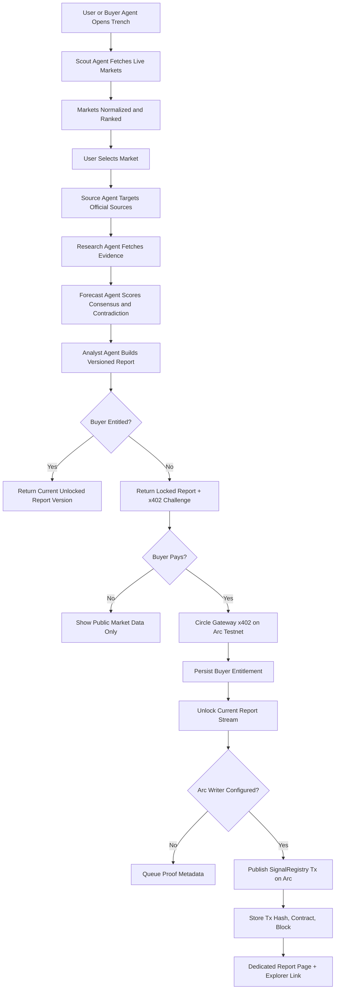

# Trench

Trench is an agentic prediction-market intelligence desk for Agora Agents. Buyer wallets can discover live markets, request paid analyst packets, satisfy an x402 USDC challenge, unlock a versioned report stream, and publish report hashes to Arc through `SignalRegistry`.

The current V2 product focuses on a judge-visible loop: market discovery, evidence-backed autonomous scoring, paid report unlock, persistent buyer entitlements, report versioning, and Arc proof publication.

## Why It Exists

Prediction markets are useful only when someone can continuously watch prices, liquidity, deadlines, and news-driven drift. Trench turns that work into an agent workflow:

- **Scout Agent** ranks active markets by liquidity, volume, and deadline pressure.
- **Source Agent** targets official sources, regulator pages, investor relations pages, and primary announcements when the market needs authority.
- **Research Agent** fetches external evidence and scores relevance, reliability, stance, and ambiguity.
- **Forecast Agent** turns evidence into fair value with consensus, contradiction, liquidity, deadline, and confidence-cap diagnostics.
- **Analyst Agent** packages the signal, dynamic price, catalysts, risks, monitoring triggers, and locked report hash.
- **Buyer Agent** requests locked reports and handles the x402 payment path.
- **Arc Proof Agent** publishes, or queues, report hash and signal metadata through `SignalRegistry`.

Public browsing remains open without a wallet. Wallet context is only needed for paid report access, persistent entitlements, and Arc proof actions.

## Technical Flow



## Architecture

```text
src/
  components/          React UI surfaces, market detail, success modal, report page
  lib/                 Frontend formatting and Arc explorer helpers
  services/            Browser API clients and wallet/x402 buyer flow
  types/               Frontend market and report contracts

server/
  agents/              Scout, Analyst, Buyer, Arc Proof logic
  chain/               Arc Testnet chain config and registry writer
  contracts/           TypeScript ABI helpers
  lib/                 Probability, edge, confidence, hash helpers
  storage/             JSON fallback + optional Supabase report/entitlement store
  index.ts             Express API and x402-ready report unlock route

contracts/
  SignalRegistry.sol   Immutable onchain signal/report registry

supabase/
  schema.sql           Reports, entitlements, and market snapshot schema
```

## Repository Structure

```text
trench-markets/
|-- .env.example
|-- .gitignore
|-- README.md
|-- eslint.config.js
|-- index.html
|-- package-lock.json
|-- package.json
|-- postcss.config.js
|-- tailwind.config.js
|-- tsconfig.app.json
|-- tsconfig.json
|-- tsconfig.node.json
|-- tsconfig.server.json
|-- vite.config.ts
|-- contracts/
|   `-- SignalRegistry.sol
|-- public/
|   `-- favicon.svg
|-- scripts/
|   `-- api-dev.mjs
|-- server/
|   |-- index.ts
|   |-- solc.d.ts
|   |-- types.ts
|   |-- agents/
|   |   |-- analystAgent.ts
|   |   |-- arcProofAgent.ts
|   |   |-- buyerAgent.ts
|   |   |-- evidenceEngine.ts
|   |   `-- scoutAgent.ts
|   |-- chain/
|   |   |-- arc.ts
|   |   `-- signalRegistryWriter.ts
|   |-- contracts/
|   |   |-- compileSignalRegistry.ts
|   |   `-- signalRegistry.ts
|   |-- lib/
|   |   |-- env.ts
|   |   `-- math.ts
|   |-- scripts/
|   |   |-- compileSignalRegistry.ts
|   |   |-- deploySignalRegistry.ts
|   |   |-- gatewayBalances.ts
|   |   `-- gatewayDeposit.ts
|   `-- storage/
|       `-- reportStore.ts
|-- src/
|   |-- App.tsx
|   |-- index.css
|   |-- main.tsx
|   |-- assets/
|   |   |-- hero.png
|   |   |-- react.svg
|   |   `-- vite.svg
|   |-- components/
|   |   |-- AgentDesk.tsx
|   |   |-- AgentProtocol.tsx
|   |   |-- AnalysisPanel.tsx
|   |   |-- CreateMarketPanel.tsx
|   |   |-- Footer.tsx
|   |   |-- HowItWorksModal.tsx
|   |   |-- Intro.tsx
|   |   |-- MarketBoard.tsx
|   |   |-- MarketCard.tsx
|   |   |-- MarketDetail.tsx
|   |   |-- MarketRail.tsx
|   |   |-- MarketTabs.tsx
|   |   |-- MiniIcon.tsx
|   |   |-- PublishSuccessModal.tsx
|   |   |-- ReportPage.tsx
|   |   |-- SettlementPanel.tsx
|   |   |-- Topbar.tsx
|   |   `-- TrenchMark.tsx
|   |-- data/
|   |   `-- markets.ts
|   |-- lib/
|   |   |-- api.ts
|   |   |-- explorer.ts
|   |   |-- format.ts
|   |   `-- marketMath.ts
|   |-- services/
|   |   |-- agents.ts
|   |   |-- gamma.ts
|   |   `-- x402BuyerWallet.ts
|   `-- types/
|       |-- market.ts
|       `-- report.ts
`-- supabase/
    `-- schema.sql
```

## Product Model

Reports are **versioned**. If market price or evidence drifts, Trench can generate a new report version instead of mutating the old one.

Buyer access is an entitlement to a market's report stream:

```text
buyer wallet + market id -> unlocked report stream
```

That means a buyer who paid for a market can return later and view the current report version without paying again. New buyers still receive a locked report and x402 challenge.

## API Surface

| Route | Purpose |
| --- | --- |
| `GET /api/markets` | Runs Scout Agent and returns ranked markets. |
| `GET /api/gateway/balances/:address` | Checks Circle Gateway USDC balance for a wallet. |
| `GET /api/reports/:marketId?buyer=0x...` | Returns the current report, unlocked only if the buyer has entitlement. |
| `POST /api/analyze` | Runs or retrieves Analyst Agent output for a selected market. |
| `POST /api/reports/request` | Returns unlocked report for entitled buyers, otherwise returns locked report and x402 challenge. |
| `POST /api/reports/unlock` | x402-protected unlock route for buyer wallet payments. |
| `POST /api/payments/sponsored` | Sponsored/local demo unlock path. |
| `POST /api/proofs` | Publishes report metadata to Arc when configured, otherwise queues proof metadata for demo mode. |
| `GET /api/health` | Shows API and x402 configuration state. |

## Supabase Storage

Trench uses JSON storage by default and upgrades to Supabase when these variables are present:

```bash
SUPABASE_URL=https://your-project.supabase.co
SUPABASE_SERVICE_ROLE_KEY=...
TRENCH_STORE_PATH=data/trench-store.json
REPORT_REFRESH_MINUTES=15
```

Run [supabase/schema.sql](supabase/schema.sql) in the Supabase SQL Editor. The service role key is backend-only and must never be exposed to the frontend.

Stored records:

- `reports`: versioned report payloads keyed by market id and report hash.
- `report_entitlements`: buyer wallet access to market report streams.
- `market_snapshots`: reserved for future market history and freshness checks.

## Arc SignalRegistry

`contracts/SignalRegistry.sol` stores immutable proof records:

- `reportHash` as `bytes32`
- market id
- signal direction
- market probability, fair probability, confidence, and edge in basis points
- artifact URI pointing back to the Trench report namespace
- publisher address, tx hash, and block once written

Deploy the registry:

```bash
npm run contract:compile
npm run contract:deploy
```

The deploy script reads `.env`, deploys to Arc Testnet through `viem`, and prints `SIGNAL_REGISTRY_ADDRESS` to add back to `.env`.

## Local Development

Run the API with auto-restart:

```bash
npm run api:dev
```

Run the frontend:

```bash
npm run dev
```

The Vite dev server proxies `/api` to `http://127.0.0.1:8787`.

## Deployment

Trench is deployed as two services:

- **Frontend:** Vercel static Vite app.
- **Backend:** Render Node web service running the Express API.

Set these variables on Vercel:

```bash
VITE_API_BASE_URL=https://your-render-api.onrender.com
VITE_ARC_EXPLORER_TX_URL=https://testnet.arcscan.app/tx/
```

Set these variables on Render:

```bash
PORT=8787
SUPABASE_URL=https://your-project.supabase.co
SUPABASE_SERVICE_ROLE_KEY=...
TRENCH_STORE_PATH=/tmp/trench-store.json
REPORT_REFRESH_MINUTES=15
ARC_RPC_URL=https://rpc.testnet.arc.network
ARC_WRITER_PRIVATE_KEY=0x...
SIGNAL_REGISTRY_ADDRESS=0x...
CIRCLE_SELLER_ADDRESS=0x...
```

Render build command:

```bash
npm install && npm run server:build
```

Render start command:

```bash
node dist-server/index.js
```

After deployment, confirm the API is reachable:

```bash
https://your-render-api.onrender.com/api/health
```

## Circle x402 Mode

Trench runs without secrets in local simulation mode. To enable the real Circle Gateway x402 path, fill `.env` before starting the API:

```bash
CIRCLE_SELLER_ADDRESS=0x...
CIRCLE_BUYER_PRIVATE_KEY=0x...
ARC_RPC_URL=https://rpc.testnet.arc.network
SIGNAL_REGISTRY_ADDRESS=0x...
ARC_WRITER_PRIVATE_KEY=0x...
```

For buyer-wallet x402 testing, the browser wallet signs a Gateway `TransferWithAuthorization` payload and the API verifies/settles it through Circle Gateway. Report unlocks persist by buyer wallet in Supabase or the local JSON fallback.

Check and fund a Gateway balance:

```bash
npm run gateway:balances
npm run gateway:deposit -- 1.00
```

Before depositing, request Arc Testnet USDC from the Circle Faucet. The same testnet USDC is used for Arc gas and Gateway-backed x402 payments.

## Current Status

- Live market ingestion is implemented.
- V2 evidence-backed analyst reports are implemented.
- Official-source targeting, consensus scoring, contradiction scoring, confidence caps, and monitoring triggers are implemented.
- Dynamic report pricing is implemented, capped for hackathon-friendly micropayments.
- Browser-wallet x402 payment is implemented for Circle Gateway on Arc Testnet.
- Persistent buyer entitlements are implemented through Supabase or JSON fallback.
- Report versioning and freshness checks are implemented.
- Dedicated report pages, publish success modal, and Arc explorer links are implemented.
- Arc proof queue is implemented, and real Arc writes activate when `SIGNAL_REGISTRY_ADDRESS` and `ARC_WRITER_PRIVATE_KEY` are configured.

## Verification

```bash
npm run lint
npm run build
npm run server:build
```
